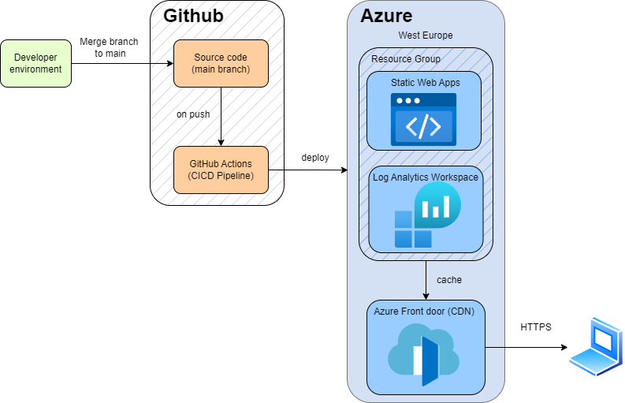

# SRE Challenge — Azure Static Web App

Provisioning a secure, publicly accessible web application on Azure using Infrastructure as Code. 
Designed to be repeatable, version controlled, and observable by default.

**Live URL:** https://purple-coast-08fcb5803.6.azurestaticapps.net

---

## Architecture



---

## Tech Stack

| Tool                  | Purpose                       |
| --------------------- | ----------------------------- |
| Terraform             | Infrastructure provisioning   |
| Azure Static Web Apps | Static site hosting           |
| Azure Log Analytics   | Observability and diagnostics |
| GitHub Actions        | Automated deployment pipeline |

---

## How To Deploy

```bash
# 1. Authenticate to Azure
az login

# 2. Configure variables
cp terraform/terraform.tfvars.example terraform/terraform.tfvars

# 3. Provision infrastructure
cd terraform && terraform init && terraform apply

# 4. Add deployment token to GitHub Secrets
az staticwebapp secrets list \
  --name your-project-name \
  --resource-group your-project-name-rg \
  --query "properties.apiKey" --output tsv
# Add as GitHub secret: AZURE_STATIC_WEB_APPS_API_TOKEN

# 5. Push to main — GitHub Actions deploys automatically

# 6. Destroy when finished
terraform destroy
```

---

## Security

| Measure                | Detail                                       |
| ---------------------- | -------------------------------------------- |
| HTTPS enforced         | Automatic, no HTTP fallback                  |
| Secrets management     | API token in GitHub Secrets, never hardcoded |
| Infrastructure as code | All config version controlled via Terraform  |
| Security headers       | Configured in `staticwebapp.config.json`     |

Headers applied to every response: `Strict-Transport-Security`,
`X-Content-Type-Options`, `X-Frame-Options`, `X-XSS-Protection`,
`Content-Security-Policy`, `Referrer-Policy`, `Permissions-Policy`.

---

## Decision Log

**Static Web Apps over App Service and Container Apps**
App Service had zero free tier quota on a new subscription. Container Apps worked but required a
Container Registry, this is not free tier compatible. 
Static Web Apps is free and serves HTML directly. It also has built in GitHub Actions integration.
All decision have been listed in the git log.

**Log Analytics retained**
Observability is essential in an SRE context, even for a static site like our example. We need to 
ensure that logging is available as we can't operate what we can't observe.

**Feature branches and conventional commits**
I have added a feature branch for each area of the project, this tells a clear story of how this was built.

---

## What I Learned

**Terraform** 
First hands on experience with Terraform in its pure form. Key learning was the concept of the dependency 
graph, then the ways to make the process more DRY i.e adding our variables, tags to separate files.

**Azure** 
Coming to grips with the services and what they can do. I have got some experience now using the UI and grasped
what is included in the free tier and how to check this in more detail.

**GitHub Actions** 
Interesting to see the differences between the Gitlab-ci and Github actions.
Secret management maps directly to environment variables in other CI systems.

---

## What I'd Improve

- Branch protection rules requiring passing checks before merge
- Log Analytics alerting for availability and error rates
- Container Apps migration for a production workload
- Custom domain with managed SSL certificate

---
